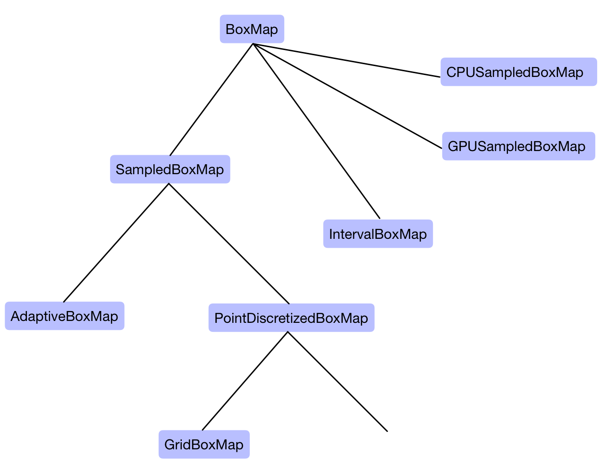

# BoxMap types

There are multiple techniques one could use to discretize point maps into maps over boxes. In [General Usage](https://gaioguys.github.io/GAIO.jl/general/) the discretization `BoxMap` was already briefly introduced. 

```@docs
BoxMap
```

We now introduce a set of `BoxMap` subtypes for different discretization algorithms. The types fit into a heirarchy described in the diagram below. 



We will work from the "bottom up", starting with specific types that are of practical use, and then generalizing these approaches for the reader who wishes to know more. 

## `MonteCarloBoxMap`

The simplest technique for discretization is a Monte-Carlo approach: choose a random set of sample points within a box and record which boxes are hit by the point map. 

```@docs
MonteCarloBoxMap
```

## `GridBoxMap`

Another naive but still useful approach is to place the test points on an equidistant grid within a box. This approach removes an element of randomness from the Monte-Carlo approach. 

```@docs
GridBoxMap
```

## `AdaptiveBoxMap`

The above approaches may not necessarily be effective for covering the setwise image of a box. For choosing test points more effectively, we can use some knowledge of the Lipschitz matrix for ``f`` in a box `Box(c, r)`, that is, a matrix ``L \in \mathbb{R}^{d \times d}`` such that 
```math
| f(y) - f(z) | \leq L \, | y - z | \quad \text{for all } y, z \in \text{Box}(c, r),
```
where the operations ``| \cdot |`` and `` \leq `` are to be understood elementwise. The function `AdaptiveBoxMap` attempts to approximate ``L`` before choosing an adaptive grid of test points in each box, as described in [1]. 

```@docs
AdaptiveBoxMap
```

## `IntervalBoxMap`

All of the above techniques provide a fast, efficient way to cover setwise images of boxes, but are not necessarily guaranteed to provide an complete covering. To avoid this as well as other numerical inaccuracies inherent in floating point arithmetic, one can use _interval arithmetic_ to guarantee a rigorous outer covering of box images. Interval arithmetic is a technique from _validated numerics_ which performs calculations while simultaneously recording the error of such calculations. A more detailed discussion and julia-implementation of interval arithmetic can be found in [`IntervalArithmetic.jl`](https://github.com/JuliaIntervals/IntervalArithmetic.jl). 

```@docs
IntervalBoxMap
```

## `CPUSampledBoxMap`

Naturally, if an increase in accuracy is desired in a `SampledBoxMap`, a larger set of test points may be chosen. This leads to a dilemma: the more accurate we wish our approximation to be, the more we need to map very similar test points forward, causing a considerable slow down for complicated dynamical systems. However, the process of mapping each test point forward is completely independent on other test points. This means we do not need to perform each calculation sequentially; we can parallelize. 

If the point map only uses "basic" instructions, then it is possible to simultaneously apply Single Instructions to Multiple Data (SIMD). This way multiple funnction calls can be made at the same time, increasing performance. For more details, see the [maximizing performance section](https://gaioguys.github.io/GAIO.jl/simd/). 

```@docs
GridBoxMap(c::Val{:cpu}, map, domain::Box{N,T}; no_of_points) where {N,T}
MonteCarloBoxMap(c::Val{:cpu}, map, domain::Box{N,T}; no_of_points) where {N,T}
```

## `GPUSampledBoxmap`

If an Nvidia gpu is available, the above technique can be improved dramatically. The gpu uses a "massively parallel programming" paradigm, which fits perfectly to the problem of mapping many sample points independently. For more information, see the [maximizing performance section](https://gaioguys.github.io/GAIO.jl/cuda/).

```@docs
GridBoxMap(c::Val{:cpu}, map, domain::Box{N,T}; no_of_points) where {N,T}
MonteCarloBoxMap(c::Val{:cpu}, map, domain::Box{N,T}; no_of_points) where {N,T}
```

## `PointDiscretizedBoxMap`

A generalization of `MonteCarloBoxMap` and `GridBoxMap` can be defined as follows: 
1. we provide a "global" set of test points within the unit cube ``[-1,1]^d``. 
2. For each box `Box(c,r)`, we rescale the global test points to lie within the box by calculating `c .+ r .* p` for each global test point `p`. 

```@docs
PointDiscretizedBoxMap
```

## `SampledBoxMap`

We can even further generalize the concept of `MonteCarloBoxMap`, `GridBoxMap`, `PointDiscretizedBoxMap` as follows: we define two functions `domain_points(c, r)` and `image_points(c, r)` for any `Box(c, r)`. 
1. for each box `Box(c, r)` a set of test points within the box is initialized using `domain_points(C, r)` and mapped forward by the point map. 
2. For each of the pointwise images `fc`, an optional set of "perturbations" can be applied. These perturbations are generated with `image_points(fc, r)`. The boxes which are hit by these perturbations are recorded. 

```@docs
SampledBoxMap
CPUSampledBoxMap
GPUSampledBoxmap
```

## Creating you own BoxMap type

Subtypes of the abstract type `BoxMap` must have three restrictions:
1. There must be a `domain` field within the type, i.e.
   ```julia
   struct MyBoxMap{N,T}
       domain::Box{N,T}
       # other things ...
   end
   ```
2. There must be a method `map_boxes(g::MyBoxMap, source::BoxSet)` which computes the setwise image of `source` under `g` and returns a `BoxSet`. 
3. There must be a method `construct_transfers(g::MyBoxMap, source::BoxSet)` which computes a dictionary-of-keys sparse matrix `mat` with `mat[(hit_key, source_key)] = weight` for the TransferOperator, as well as a `BoxSet` called `variant_set` which is `setdiff(g(source), source)`. These are both returned by `construct_transfers(g::MyBoxMap, source::BoxSet)`. 

## References

[1] Oliver Junge. “Rigorous discretization of subdivision techniques”. In: _International Conference on Differential Equations_. Ed. by B. Fiedler, K. Gröger, and J. Sprekels. 1999.
