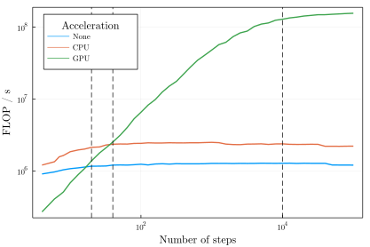

# `GPUSampledBoxmap`

If an Nvidia gpu is available, the above technique can be improved dramatically. The gpu uses a "massively parallel programming" paradigm, which fits perfectly to the problem of mapping many sample points independently. For more information, see the [maximizing performance section](https://gaioguys.github.io/GAIO.jl/cuda/).

!!! note "`GridBoxMap(c::Val{:gpu}, map, domain::Box{N,T}; no_of_points) where {N,T}`"
    ```julia
    BoxMap(:grid, :gpu, map, domain::Box{N}; n_points::NTuple{N} = ntuple(_->16, N)) -> GPUSampledBoxMap
    ```
    Construct a `GPUSampledBoxMap` that uses a grid of test points. 
    The size of the grid is defined by `n_points`, which is 
    a tuple of length equal to the dimension of the domain. 
    Requires a CUDA-capable gpu. 

!!! note "`MonteCarloBoxMap(c::Val{:gpu}, map, domain::Box{N,T}; no_of_points) where {N,T}`"
    ```julia
    BoxMap(:montecarlo, :gpu, map, domain::Box{N}; n_points=16*N) -> GPUSampledBoxMap
    ```
    Construct a `GPUSampledBoxMap` that uses `n_points` 
    Monte-Carlo test points. 
    Requires a CUDA-capable gpu. 


Using the gpu, a speed increase of up to 200x can be achieved. 



### Example

```@setup 1
using GAIO
using Plots

# We choose a simple but expanding map
const α, β, γ, δ, ω = 2., 9.2, 10., 2., 10.
f((x, y)) = (α + β*x + γ*y*(1-y), δ + ω*y)

midpoint = round.(Int, ( 1+(α+β+γ/4)/2, 1+(δ+ω)/2 ), RoundUp)
domain = Box(midpoint, midpoint)

P = BoxPartition(domain, 2 .* midpoint)
p = plot(cover(P, :), linewidth=0.5, fillcolor=nothing, lab="", leg=:outerbottom)

# unit box
B = cover(P, (0,0))
p = plot!(p, B, linewidth=4, fillcolor=RGBA(0.,0.,1.,0.2), linecolor=RGBA(0.,0.,1.,0.4), lab="Box")

# Plot the true image of B under f.
z = zeros(100)
boundary = [
    0       0;
    1       0;
    z.+1    0.01:0.01:1;
    0       1;
    z       0.99:-0.01:0;
]
b = f.(eachrow(boundary))
boundary .= [first.(b) last.(b)]
p = plot!(p, boundary[:, 1], boundary[:, 2], linewidth=4, fill=(0, RGBA(0.,0.,1.,0.2)), color=RGBA(0.,0.,1.,0.4), lab="True image under f")
```

```julia
using CUDA

n_points = 2048
F = BoxMap(:montecarlo, :gpu, f, domain, n_points = n_points)
p = plot!(
    p, F(B), 
    color=RGBA(1.,0.,0.,0.5), 
    lab="$n_points MonteCarlo test points"
)
```

```@setup 1
using SIMD

n_points = 2048
F = BoxMap(:montecarlo, :simd, f, domain, n_points = n_points)
p = plot!(
    p, F(B), 
    color=RGBA(1.,0.,0.,0.5), 
    lab="$n_points MonteCarlo test points"
)

savefig("cuda.svg"); nothing # hide
```


