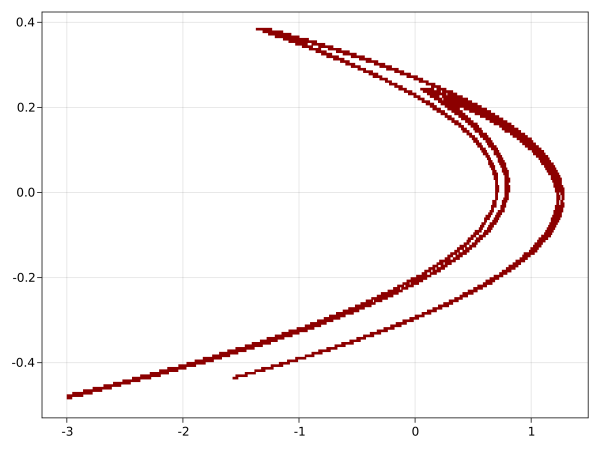

# Getting started

Consider the [Hénon map](https://en.wikipedia.org/wiki/H%C3%A9non_map) [1]
```math
f(x,y) = (1-ax^2+y, bx), \quad a,b \in \mathbb{R}
```
Iterating some random intial point exhibits a strange attractor (a=1.4 and b=0.3)


Since this map is _chaotic_ [2,3], it has sensitive dependence on initial conditions.  That is, small perturbations (as unavoidable on a computer) during the computation grow exponentially during the iteration.  Thus, apart from a few iterates at the beginning, the computed trajectory does not (necessarily) follow a true trajectory. One might therefore question how reliable this figure is.

Instead of trying to approximate the attractor by a long forward trajectory, we will capture it by computing a collection of boxes (i.e. cubes) covering the attractor. 

Start by loading the GAIO package
```julia
using GAIO
```
A `Box` is descibed by its center and its radius
```julia
box_center, box_radius = (0,0), (3,3)
Q = Box(box_center, box_radius)
```
This box will serve as the domain for our computation.  The box covering which we will compute is a subset of a _partition_ of Q into smaller boxes. The command
```julia
P = BoxPartition(Q, (4,4)) 
```
yields a partition of Q into a grid of 4 x 4 equally sized smaller boxes. From P, box sets can be constructed. For example, the command
```julia
B = P[:]
```
yields a `BoxSet` containing all boxes from the partition P (i.e. a set containing 16 boxes).

In order to deal with the Hénon map as a map on box sets, we have to turn it into a `BoxMap` on the given partition P
```julia
a, b = 1.4, 0.3
f((x,y)) = (1 - a*x^2 + y, b*x) 
F = BoxMap(f, P) 
```
We can now compute a covering of the attractor in Q, starting with the full box set B, by applying 15 steps of the subdivison algorithm described in [4]:
```julia
A = relative_attractor(F, B, steps = 15)  
plot(A)
```



In addition to covering the attractor, this box collection also covers an unstable fixed point near (-1,-0.3) and its unstabe manifold (cf. [4]).

## References

[1] Hénon, Michel. "A two-dimensional mapping with a strange attractor". Communications in Mathematical Physics 50.1 (1976): 69–77.

[2] Benedicks, Michael, and Lennart Carleson. "The dynamics of the Hénon map." Annals of Mathematics 133.1 (1991): 73-169.

[3] Zgliczynski, Piotr. "Computer assisted proof of chaos in the Rössler equations and in the Hénon map." Nonlinearity 10.1 (1997): 243. 

[4] Dellnitz, Michael, and Andreas Hohmann. "A subdivision algorithm for the computation of unstable manifolds and global attractors." Numerische Mathematik 75.3 (1997): 293-317.
