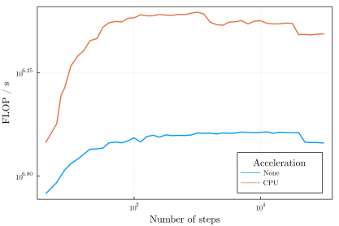

# Using the CPU

## Tutorial

This example demonstrates how to get a ~2x speedup in your code using your CPU's SIMD capabilities. 

Consider the point map `f`:
```julia
using GAIO

const σ, ρ, β = 10.0, 28.0, 0.4
function v(x)
    # Some map, here we use the Lorenz equation
    dx = (
           σ * x[2] -    σ * x[1],
           ρ * x[1] - x[1] * x[3] - x[2],
        x[1] * x[2] -    β * x[3]
    )
    return dx
end

# set f as 20 steps of the classic 4th order RK method
f(x) = rk4_flow_map(v, x, 0.01, 20)
```

Internally, GAIO calls this function on many test points within the various boxes. This means many function calls have to be made. Notably, all of these function calls are independent of one another, meaning that they can be performed in parallel. If your function only uses "basic" instructions, then it is possible to simultaneously apply Single Instructions to Multiple Data (SIMD). This way multiple funnction calls can be made at the same time, increasing performance. 

!!! tip "Which instructions are supported?"
    GAIO.jl uses SIMD.jl to explicitly vectorize operations. To see precisely which instructions are supported, refer to [the documentation for SIMD.jl](https://github.com/eschnett/SIMD.jl.git). 

All we need to do is load the SIMD.jl package and pass `:simd` as the second argument to one of the box map constructors, eg. `BoxMap(:montecarlo, ...)`, `BoxMap(:grid, ...)`. 
```julia
using SIMD

center, radius = (0,0,25), (30,30,30)
Q = Box(center, radius)
P = GridPartition(Q, (128,128,128))
F = BoxMap(:montecarlo, :simd, f, Q)

x = (sqrt(β*(ρ-1)), sqrt(β*(ρ-1)), ρ-1)
S = cover(P, x)
@time W = unstable_set(F, S)
```

Using SIMD vectorization, one can roughly double the effective floating point operations per second. For more detail, see [GAIO.jl](@cite). 



## I get `MethodError: No method matching f(::StaticArrays.SVector{SIMD.Vec{simd,Float64},N})`

If your code returns a `MethodError` with reference to `SIMD.Vec` somewhere, this most likely means that your pointmap `f` uses operations not explicitly supported by SIMD.jl. In this case, one you may need to rewrite sections of `f` to use only supported operations. For example, consider a "scaled" Lorenz flow map 
```julia
function v(x_in)
    
    x = x_in ./ sqrt(norm(x_in))

    dx = (
           σ * x[2] -    σ * x[1],
           ρ * x[1] - x[1] * x[3] - x[2],
        x[1] * x[2] -    β * x[3]
    )
    return dx
end

f(x) = rk4_flow_map(v, x)
```
This code will return a `MethodError` due to `LinearAlgebra.norm`. For the ``L^2`` norm, this can be manually rewritten as follows: 
```julia
function v(x_in)
    
    sqnorm = sum(y -> y*y, x_in)
    sqnorm = sqrt(sqrt(sqnorm))

    x = (
        x_in[1] / sqnorm,
        x_in[2] / sqnorm,
        x_in[3] / sqnorm
    )

    dx = (
           σ * x[2] -    σ * x[1],
           ρ * x[1] - x[1] * x[3] - x[2],
        x[1] * x[2] -    β * x[3]
    )
    return dx
end

f(x) = rk4_flow_map(v, x)
```
Generally, most "simple" functions can be rewritten (if needed) to support SIMD.jl. However, more complicated functions can make rewriting unnecessarily difficult. 
