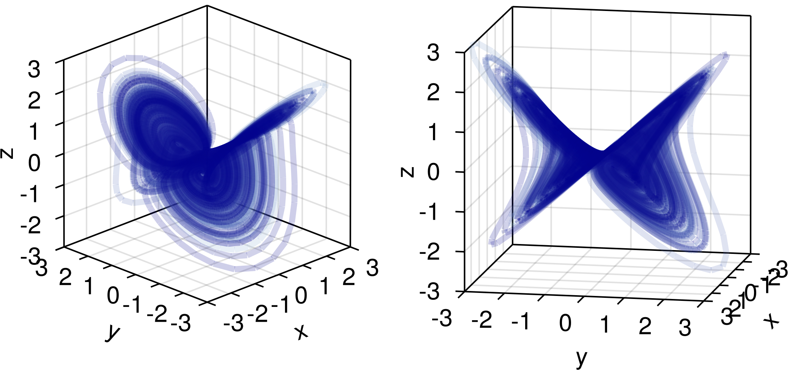
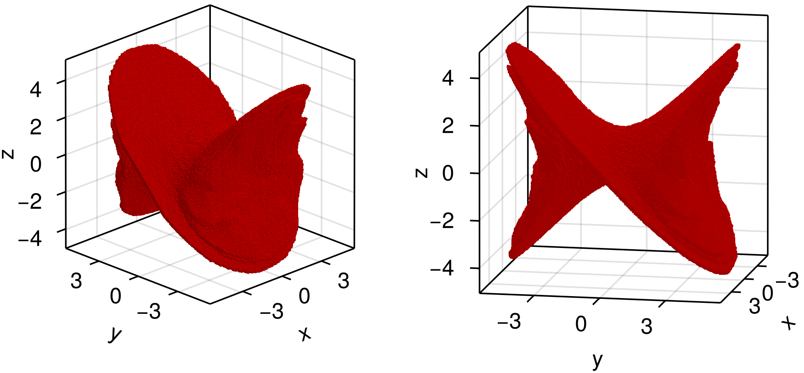
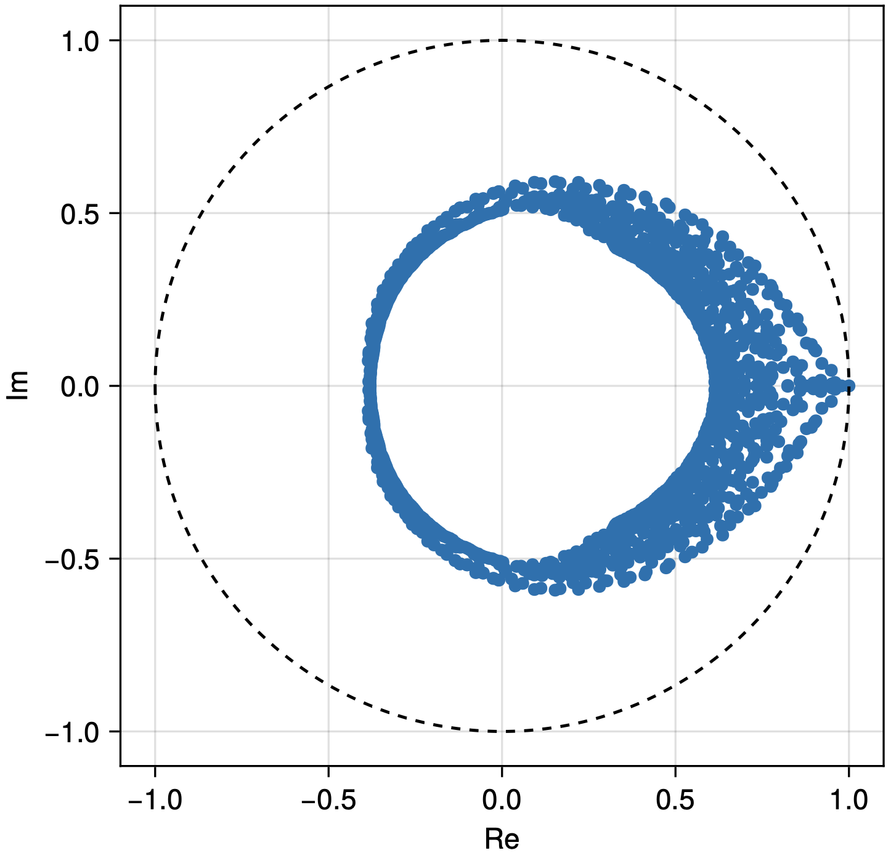
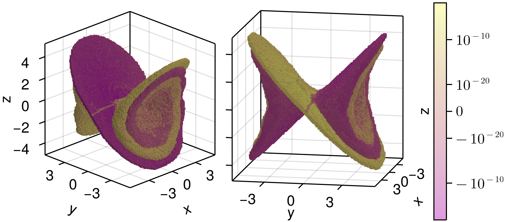

# Summary

We provide an implementation of set-oriented numerical methods [@DeJu:02; @DeFrJu:01] in a Julia package. In the context of dynamical systems, the package enables the rigorous computation of invariant sets (e.g. chain recurrent sets, attractors and invariant manifolds) and provides discretizations of the transfer and the Koopman operator, enabling the computation of, e.g., invariant measures, almost invariant, cyclic and coherent sets. The redesign of the original implementation [@GAIO] in Julia presented in this note has a more concise syntax, while showing the same or even better performance.


# Statement of Need

A *dynamical system* is a mathematical model of a system whose state evolves with time.  Key questions about the possible evolutions in a system  include whether certain subsets of state space are invariant, the stability of these subsets as well as questions about statistical properties of typical trajectories. Such topological and statistical questions (among others) can be answered using *set-oriented* numerical techniques [@DeJu:02; @DeFrJu:01], see also [@Hsu:13; @Mi:02]. 

This note presents an implementation of a set-oriented approach  to numerical computations [@DeJu:02; @DeFrJu:01] in the Julia language, encapsulated in the package GAIO.jl. The data structures and the algorithmic interface have been completely redesigned over the original implementation in C/MATLAB [@GAIO]. As a result, the code is much more concise and closer to the mathematical formulation of the underlying algorithms. At the same time, the performance is equal or better. We showcase the features of GAIO.jl by some classical computations of (almost) invariant sets and invariant measures in dynamical systems.  


# Global Analysis of Dynamical Systems

A dynamical system in which time is modelled in discrete steps is given by a map $f : X \to X$ on some domain $X$. Here, we assume $X$ to be a compact subset of $\mathbb{R}^d$ and $f$ to be a homeomorphism, i.e. bijective and continuous with a continuous inverse. We recall some basic notions from dynamical systems  required for the subsequent examples. 


## Geometric/topological analysis

A set $S \subset X$ is *forward invariant* if $f(S) \subset S$, *backward invariant* if $f^{-1}(S) \subset S$ [^preimage], and *invariant* if it is both forward and backward invariant. An invariant set $S$ is called *attracting* if there exists a neighborhood $U \supset S$ such that for any other neighborhood $V \supset S$ there exists a $k_0 \in \mathbb{N}$ such that $f^k (U) \subset V$ for all $k\geq k_0$. 

[^preimage]: $f^{-1}(S)=\{x\in X: f(x)\in S\}$ denotes the *preimage* of $S$

The *maximal invariant set* contained in some set $S$ is  
    $$
        \text{Inv} (S) = \{ x \in S \mid f^k (x) \in S \text{ for all } k \in \mathbb{Z} \} .
    $$

It follows immediately from the definition that $\text{Inv} (S)$ contains all other invariant sets which are contained in $S$. The following proposition is important for its computation. 

**Proposition:**
    [@maxinvset]
    If $S \subset X$ is forward invariant, then $\text{Inv} (S) = \bigcap_{k \geq 0} f^k (S)$. 

If $S$ is not forward invariant, the set $A_S := \bigcap_{k \geq 0} f^k (S)$ is called the *attractor relative to $S$* [@DeHo:97]. 

The proposition leads to a natural algorithm for approximation by repeatedly tightening a cover of the set $A_S$ by finite collections of subsets of $X$ [@DeHo:97]. Specifically, given a partition $\mathcal{Q}$ of $X$ into (essentially) disjoint sets and some covering $\mathcal{A}\subset\mathcal{Q}$ of $A_Y$, repeat the following two steps until a prescribed diameter of the partition elements is reached:

- Refine $\mathcal{Q}$ into a strictly finer partition $\mathcal{Q}'$ (i.e.\ such that $\text{diam} (\mathcal{Q}') \leq \theta \cdot \text{diam} (\mathcal{Q})$ for some fixed $\theta < 1$). Let $\mathcal{A}'$ be the corresponding refinement of the covering $\mathcal{A}$ of $A_Y$. 
- Map the refined covering forward under $f$, i.e. cover [^cover] $f(\vert\mathcal{A}'\vert)$  by elements of $\mathcal{X}'$. Intersect this covering with $\mathcal{A}'$. 

[^cover]: $\vert \mathcal{A} \vert = \bigcup_{\chi \in \mathcal{A}} \chi$

A simple way to partition a *box* $$X = \left[ \ell_1, u_1 \right] \times \ldots \times \left[ \ell_d, u_d \right]$$  is to divide it into an $n_1 \times \ldots \times n_d$ - element grid of boxes. 


## Example: A four wing attractor

Consider the ordinary differential equation [@3dattractor]
$$
    \begin{split}
        &\dot{x} = ax + yz \\
        &\dot{y} = dy + bx - zy \\ 
        &\dot{z} = -z - xy 
    \end{split}
$$
where $a,b,d \in \mathbb{R}$ are parameters. Let $f$ be the time-$2$ flow map of the system, discretized using $20$ steps of the standard Runge-Kutta fourth order method:
```Julia
using GAIO
const a, b, d = 0.2, -0.01, -0.4
v((x,y,z)) = @. (a*x+y*z, d*y+b*x-z*y, -z-x*y)
f(x) = rk4_flow_map(v, x, 0.01, 20)
```
We start by computing a long trajectory, starting at some point close to the attractor of the system:
```Julia
x0 = (0.94, -2.2, 0.4)
trajectory = [x0]
for _ in 1:100_000
    x = trajectory[end]
    push!(trajectory, f(x))
end
lines(trajectory)
```
Figure \ref{fig:trajectories} shows the resulting trajectory.  Of course, any other package for solving initial value problems can be used in order to approximate the flow map. Note, however, that later we will need to evaluate $f$ on many initial conditions so efficiency of the solver matters.



We now implement the above algorithm and then use it to compute a covering of the attractor of the system.  

For step (1), we construct a `BoxGrid` $\mathcal{Q}$ which partitions the domain box $X = \left[ -5, 5 \right]^3$ into a $2 \times 2 \times 2$ grid of boxes. We choose a (very rough) covering of where we expect the relative attractor may be, namely the whole domain: 
```Julia
center, radius = (0.,0.,0.), (5.,5.,5.)
X = Box(center, radius)
Q = BoxGrid(X, (2, 2, 2))
A = cover(Q, :)
```
One can think of the `BoxGrid`[^grid] $\mathcal{P}$ as a representation of the power set[^power] $\mathcal{P}(\mathcal{X})$ of $\mathcal{X}$. The command
```Julia
subdivide(A, k)
```
yields a refinement $\mathcal{A}'$ of the `BoxSet` $\mathcal{A}$ by bisecting each box in the $k$-th coordinate direction.

[^grid]: In Julia, one can input characters like $\mathcal{P}$ by typing `\scrP`.

[^power]: The *power set* $\mathcal{P}(S)$ of some set $S$ is the set of all subsets of $S$.

In order to implement step (2) of the algorithm, we first note that the flow map $f$ induces a map $F : \mathcal{P}(\mathcal{Q}) \to \mathcal{P}(\mathcal{Q})$ on the power set via 
$$
    F \left( \left\{ \chi \right\} \right) = 
    %\bigcup_{\substack{
    %    C \in \mathcal{X} \\ C \cap f(B) \neq \emptyset
    %}} \left\{ C\right\}
    \left\{ \hat\chi \in \mathcal{Q} \mid \hat\chi \cap f(\chi) \neq \emptyset \right\}.
$$

{ width=60% }

GAIO.jl provides multiple methods for approximating the map $F$. An intuitive method is to randomly sample some points (from a uniform distribution) within a box, and then map each point with $f$. Such an approximation to the map $F$ can be instantiated by  
```Julia
F = BoxMap(:montecarlo, f, P)
```
If a rigorous (outer) cover of the image $F(\{\chi\})$ is required, special sampling techniques [@rigoroussampling] and/or interval arithmetic can be used. We can now implement the above algorithm: 
```Julia
function relative_attractor(F, A; steps)
    for k in 1:steps
        A = subdivide(A, k%3+1)
        A = F(A) ∩ A
    end
    return A
end
```
In each iteration we cycle through the coordinate direction in which we bisect the boxes of the current covering. Compare with the implementation in Matlab, below. We invoke this function on the initial covering $\mathcal{A}$, resulting in the covering of the attractor shown in Fig. \ref{fig:attractor}:
```Julia
A = relative_attractor(F, A, steps=21)
plot(A)
```



Other algorithms implemented in GAIO.jl include ones for, e.g., computing forward, backward and maximal invariant sets, (un-)stable manifolds, chain-recurrent sets and Morse decompositions.


## Statistical analysis

The map $f:X \to X$ induces a map $f_\sharp : \mathcal{M} \to \mathcal{M}$ on measures[^measure] via 
$$
    f_\sharp\, \mu := \mu \circ f^{-1}.
$$

[^measure]: $\mathcal{M}$ denotes the space of finite, complex valued Borel measures on $X$

This is a bounded linear Markov operator, the *Perron-Frobenius* or *transfer operator*. Much information about macroscopic features of the dynamics of $f$ can be extracted from eigenmeasures of $f_\sharp$ at eigenvalues with modulus close to one [@DeJu:99]. 

In particular, in our setting there exists [@invariantmeasureexistence] an eigenmeasure $\mu = f_\sharp\, \mu$ at the eigenvalue $1$ of $f_\sharp$, an *invariant measure*. A *natural* invariant measure [@Hunt2004] quantifies the statistics of typical trajectories: regions of phase space which are visited more often by such trajectories receive more $\mu$-mass.  


## Discretization

One can approximate some $\mu\in\mathcal{M}$ by a discrete measure 
$$
    \mu_g(S) = \sum_{j=1}^{n} g_j \frac{m(\chi_j \cap S)}{m(\chi_j)}, 
$$
where $\{ \chi_1, \chi_2, \ldots, \chi_n\}$ is a (subset of a) partition $\mathcal{Q}$ of $X$, $g=(g_1,\ldots,g_n)\in\mathbb{C}^n$ and $m$ is Lebesgue measure on $\mathbb{R}^d$. The coefficients $g$ of an approximate invariant measure should then satisfy
$$
    g_i = \mu_g (\chi_i) \overset{!}{=} f_\sharp\, \mu_g (\chi_i) = 
    \sum_{j=1}^{n} g_j
    \underbrace{\frac{m(\chi_j \cap f^{-1} (\chi_i))}{m(\chi_j)}}_{
    =: \left( F_\sharp \right)_{ij}
    }. 
$$
The matrix $F_\sharp\in\mathbb{R}^{n\times n}$ defines a Markov chain on $\mathcal{Q}$ and is our finite approximation of $f_\sharp$ on $\mathcal{M}_n=\{\mu_g:g\in\mathbb{C}^n\}$. Convergence of the spectrum of this approximation (known as *Ulam's method*) can be shown by considering a small random perturbation of the original map $f$ [@DeJu:99]. The matrix $F_\sharp$ can be computed similarly to how the image for $F$ is computed, e.g. by approximating the transition probabilities $(F_\sharp)_{ij}$ using random sample points.

As an example, we compute $F_\sharp$ on the covering of the attractor constructed  above and then use the `eigs` function from Arpack.jl in order to compute part of the spectrum of $F_\sharp$, which is shown in Fig. \ref{fig:spectrum}.
```Julia
T = TransferOperator(F, A, A)
lambda, ev, n_converged = eigs(T)
scatter(lambda)
```

{ width=60% }

The eigenvalue $1$ is simple, the corresponding approximate invariant measure is shown in Fig. \ref{fig:invariantmeasure}. 


In Fig. \ref{fig:almostinvariant}, we further show the eigenmeasure at the second largest real eigenvalue $\lambda\approx 0.978$. By its sign structure, this measure decomposes the attractor into two almost invariant sets [@DeJu:99], i.e. two sets $A_-,A_+$ for which the invariance ratio $m(A_+\cap f^{-1} (A_+))/m(A_+)$ (resp. $A_-$) is close to $1$.




# GAIO in the Julia Language


## Philosophy

The data structures and algorithms that make up GAIO were originally developed in the $90$'s and written in C [@DeFrJu:01]. An interface was written in Python which made use of the Numerical Python environment [@harris2020array], and 3D plotting was done by writing files which were then read by the dedicated visualization software GRAPE [@RuWi92a].  Later, a second interface was written in MATLAB.  It comes as no surprise that this architecture was hard to maintain (see Fig. \ref{fig:old_arch}). For this reason, the architecture was stripped to just the core (in C) and the Matlab interface in 2015. Still, GAIO was a picture book incarnation of the *two language problem* [@bezanson2017julia]. 


GAIO was fully redesigned and rebuilt in the Julia language starting in 2020. The reason to do so (and the decision to use Julia) was twofold:

- *Solving the two language problem.* The set-oriented techniques require too many evaluations of the map $f$ to be reasonably implemented in an interpreted language. As with many scientific computing applications, compilation into fast machine code is necessary if one wishes to apply the methods to a non-trivial problem. However, the code should still be easy to write and read. 
    
- *Abstraction of the syntax.* The original GAIO code required the user to be aware of the details of the internal data structures. For example, box collections were stored in a binary tree and flags in the nodes of that tree were used in order to implement the box map $F:\mathcal{P}(\mathcal{Q})\to \mathcal{P}(\mathcal{Q})$. Here is the original GAIO/MATLAB implementation of the algorithm for computing the relative global attractor:
```matlab
function relative_attractor(tree, f, steps)
    for i = 1:steps,
        tree.set_flags('all', to_be_subdivided); 
        tree.subdivide(to_be_subdivided);   
        b = tree.boxes(-1); 
        while (~isempty(b))
            c = b(1:d); 
            r = b(d+1:2*d);
            P = X*diag(r)+ones(size(X))*diag(c); 
            tree.set_flags(f(P)', hit);          
            b = tree.next_box(-1);
        end
        tree.remove(hit);                         
    end
```

In contrast, in GAIO.jl, details on how box collections are stored and how the box map $F:\mathcal{P}(\mathcal{Q})\to \mathcal{P}(\mathcal{Q})$ is realized are essentially completely hidden from the user. After defining $F$ as a `BoxMap`, it can simply be applied to a `BoxSet`, resulting in another `BoxSet`. Since `BoxSet` is a subtype of `AbstractSet`, all set operations can be applied. As a result, the implementation of set-oriented algorithms - like the algorithm for computing relative attractors - is very close to its mathematical formulation.


## Fitting into Julia's ecosystem

Another reason for the decision to use Julia for GAIO.jl is the large (and growing) open source scientific computing community. GAIO.jl makes extensive use of linear algebra routines (LinearAlgebra.jl [@bezanson2017julia]), sparse arrays (SparseArrays.jl [@bezanson2017julia], Arpack.jl [@arpack]), graph/network routines (MatrixNetworks.jl [@matrixnetworks]), and numerical integrators (DifferentialEquations.jl [@differentialequations]), plotting ecosystems (Makie.jl [@makie], Plots.jl [@plots]), among others. 

A particular example of the effectiveness of such an open source scientific computing model is CUDA.jl. The sample-point methods for cell mapping are examples of so-called *embarrassingly parallel* [@parallel] problems. It has therefore been a long-standing desire to utilize the GPU to perform such massively parallel algorithms in GAIO. However, under the previous architecture this would have to be written in CUDA's native C interface, which suffers the issues mentioned in the preceeding section. 

This is solved by the amazing work done to create CUDA.jl. The cell mapping can be written as a generic kernel whose length (in lines of code) is the same as the standard code, meaning the algorithms that make up GAIO.jl can receive up to a 200-fold [@gaiocuda] performance boost without ever sacrificing readability. 

Furthermore, the open-source nature of Julia's ecosystem has helped in programming GAIO.jl countless times. Since code is freely available, code reuse is common among the Julia community.

# Conclusion

The Julia package GAIO.jl is introduced via an example of a three dimensional dynamical system. The software has been redesigned and rebuilt from the ground up to balance high performance and elegance, no longer needing to rely on two languages to do so. Future work is planned to use these structures e.g. for homology computation in cubical complexes, as well as to even more tightly integrate into the existing scientific computing ecosystem.


