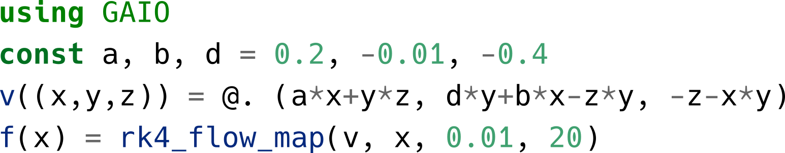
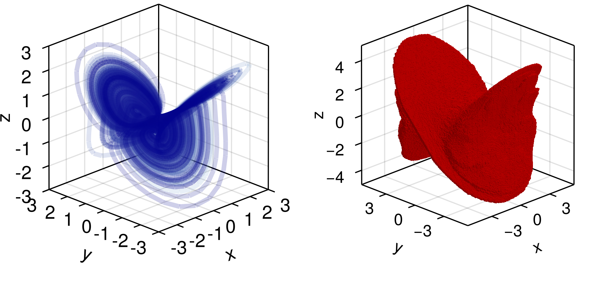
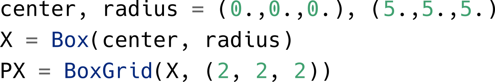
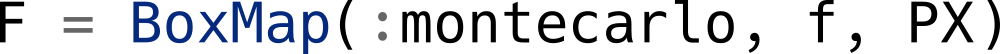
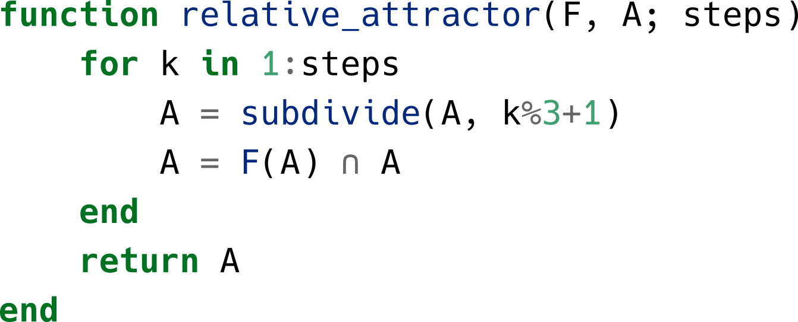
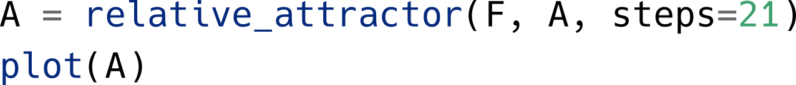
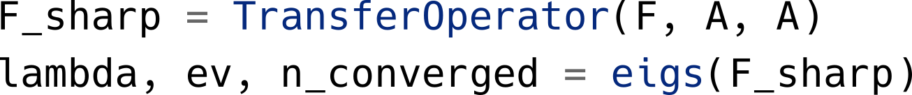
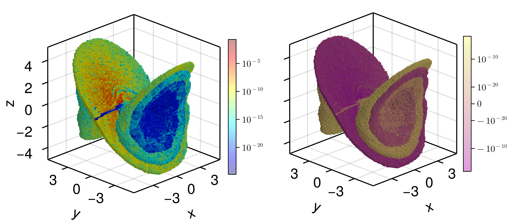
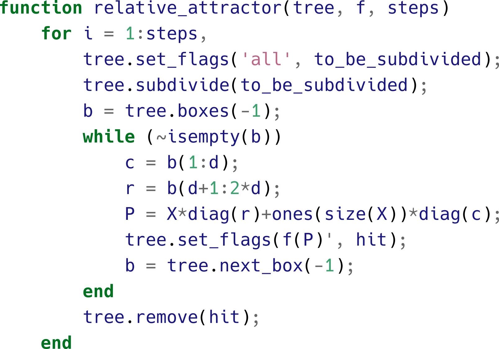

# Summary

We provide an implementation of set-oriented numerical methods [@DeJu:02; @DeFrJu:01] in a Julia package. The package enables the rigorous computation of invariant sets (e.g., chain recurrent sets, attractors, invariant manifolds) in dynamical systems and provides discretizations of the transfer and the Koopman operator, enabling the computation of, e.g., invariant measures, almost invariant, cyclic and coherent sets.  We showcase the features of GAIO.jl by some classical computations of (almost) invariant sets and invariant measures in dynamical systems.

# Statement of Need

The original implementation [@GAIO] in C/Python/MATLAB suffered from (1) a complex syntax which required unnecessary technical knowledge on the underlying data structures and (2) the two language problem, rendering extensions and maintenance difficult. The data structures and the algorithmic interface have been completely redesigned for GAIO.jl. As a result, the code is concise and close to the mathematical formulation of the underlying algorithms. At the same time, the performance is equal or better.   

# Global Analysis of Dynamical Systems

A discrete-time dynamical system is given by a map $f:X\to X$ on some domain $X$. For simplicity, we here assume a compact $X\subset\mathbb{R}^d$ and $f$ to be a homeomorphism. 

## Geometric/Topological analysis

A set $S\subset X$ is *forward invariant* if $f(S)\subset S$, *backward invariant* if $f^{-1}(S)\subset S$ [^preimage], and *invariant* if it is both forward and backward invariant. 

[^preimage]: $f^{-1}(S)=\{x\in X:f(x)\in S\}$ denotes the *preimage* of $S$.

The *maximal invariant set* contained in some set $S$ is  
$$\text{Inv}(S)=\{x\in S\mid f^k(x)\in S\text{ for all }k\in \mathbb{Z}\}.$$
It follows from the definition that $\text{Inv}(S)$ contains all other invariant sets which are contained in $S$. If $S\subset X$ is forward invariant, then $\text{Inv}(S)=\bigcap_{k\geq 0}f^k(S)$. If $S$ is not forward invariant, the set $A_S:=\bigcap_{k\geq 0}f^k(S)$ is called the *attractor relative to $S$* [@DeHo:97]. This characterization leads to a natural algorithm for approximating $A_S$ by repeatedly tightening a cover by finite collections of subsets of $X$ [@DeHo:97]: 

**Algorithm 1:** 
    Given a partition $\mathcal{X}$ of $X$ into (essentially) disjoint sets and some covering $\mathcal{A}\subset\mathcal{X}$ of $A_S$, repeat the following two steps until a prescribed diameter of the partition elements is reached:

1. Refine $\mathcal{X}$ into a strictly finer partition $\mathcal{X}'$ (i.e., such that $\text{diam}(\mathcal{X}')\leq\theta\cdot\text{diam}(\mathcal{X})$ for some fixed $\theta <1$). Let $\mathcal{A}'$ be the corresponding refinement of the covering $\mathcal{A}$ of $A_S$. 
2. Map the refined covering forward under $f$, i.e., cover [^cover] $f(\vert\mathcal{A}'\vert)$  by elements of $\mathcal{X}'$. Intersect this covering with $\mathcal{A}'$. 

[^cover]: $\vert\mathcal{A}\vert =\bigcup_{\chi\in\mathcal{A}}\chi$

In GAIO.jl, partitions resp. coverings are implemented as collections of *boxes*, i.e., multidimensional intervals of the form $\left[\ell_1,u_1\right]\times\ldots\times\left[ \ell_d,u_d\right]$.

## Example: A four wing attractor

We now implement the algorithm to compute a covering of the attractor of the system proposed in [@3dattractor]. Let $f$ be the time-$2$ flow map of the system, discretized using $20$ steps of the standard Runge-Kutta fourth order method:

{width=59%}

For demonstration we compute a long trajectory, shown in the left plot in Figure \ref{fig:trajectories}.

{ width=90% }

For step 1. in Algorithm 1, we construct a `BoxGrid` `PX` which partitions the domain $X = \left[-5,5\right]^3$ into a $2\times 2\times 2$ grid of boxes. One can think of `PX` as the power set[^power] $\mathcal{P}(\mathcal{X})$ of the partition $\mathcal{X}$: 

{width=50%}

We next construct a (coarse) initial covering, the `BoxSet` `A` consisting of all boxes in `PX`: 

{width=21%}

The command

{width=19%}

can then be used for refining the `BoxSet` `A`  by bisecting each box in the $k$-th coordinate direction.

[^power]: The *power set* $\mathcal{P}(S)$ of some set $S$ is the set of all subsets of $S$.

To implement step 2. in Algorithm 1, note that the flow map $f$ induces a map $F:\mathcal{P}(\mathcal{X})\to\mathcal{P}(\mathcal{X})$ via
$$F\left(\left\{\chi\right\}\right)=\left\{\hat\chi\in\mathcal{X}\mid\hat\chi\cap f(\chi)\neq\emptyset\right\}.$$

{width=50%}

GAIO.jl provides multiple methods for approximating $F$ [@rigoroussampling]. An intuitive method is to randomly sample some points within a box, and map each point with $f$. Such an approximation can be instantiated by  

{width=39%}

We can now fully implement the algorithm: 

{width=50%}

We cycle through the coordinate direction in which we bisect boxes in each step. We invoke `relative_attractor` on the initial covering `A`. The result is shown in the right plot in Fig. \ref{fig:trajectories}:

{width=49%}

Other algorithms in GAIO.jl include ones for, e.g., computing forward, backward and maximal invariant sets, (un-)stable manifolds, chain-recurrent sets and Morse decompositions.

## Statistical analysis

$f:X\to X$ induces a map $f_\sharp :\mathcal{M}\to\mathcal{M}$ on measures[^measure] via 
$$f_\sharp\,\mu :=\mu\circ f^{-1}.$$

[^measure]: $\mathcal{M}$ denotes the space of finite, complex valued Borel measures on $X$.

This is a linear Markov operator, the *transfer operator*. Much information about macroscopic features of the dynamics of $f$ can be extracted from eigenmeasures of $f_\sharp$ at eigenvalues with modulus close to one [@DeJu:99]. 

One can approximate $\mu\in\mathcal{M}$ by a discrete measure 
$$\mu_g(S)=\sum_{j=1}^{n}g_j\frac{m(\chi_j\cap S)}{m(\chi_j)},$$
where $\{\chi_1,\chi_2,\ldots,\chi_n\}$ enumerates the partition $\mathcal{X}$, $g=(g_1,\ldots,g_n)\in\mathbb{C}^n$ and $m$ is Lebesgue measure on $\mathbb{R}^d$. The coefficients $g$ of an approximate invariant measure $\mu_g$ should then satisfy
$$g_i=\mu_g(\chi_i)\overset{!}{=}f_\sharp\,\mu_g(\chi_i)=\sum_{j=1}^{n}g_j\underbrace{\frac{m(\chi_j\cap f^{-1}(\chi_i))}{m(\chi_j)}}_{=:\left(F_\sharp\right)_{ij}}.$$
$F_\sharp\in\mathbb{R}^{n\times n}$ defines a Markov chain on $\mathcal{X}$ and is our approximation of $f_\sharp$ on $\mathcal{M}_n=\{\mu_g:g\in\mathbb{C}^n\}$. It can be computed  by approximating the transition probabilities $(F_\sharp)_{ij}$ e.g. using random sample points.

We compute $F_\sharp$ on the covering constructed above and then compute part of its spectrum:

{width=49%}

The eigenvalue $1$ is simple, and the corresponding eigenvector approximates an invariant measure shown in the left plot in Fig. \ref{fig:invariantmeasure}. Such a (natural) invariant measure [@young2002srb] quantifies the statistics of typical trajectories: Regions of phase space which are visited more often by such trajectories receive more $\mu$-mass.  In the right of Fig. \ref{fig:invariantmeasure}, we show the eigenmeasure at the second largest real eigenvalue $\lambda\approx 0.978$. Its sign structure decomposes the attractor into two almost invariant sets [@DeJu:99], i.e., two sets $A_-,A_+$ for which the invariance ratio $m(A_+\cap f^{-1}(A_+))/m(A_+)$ (resp. $A_-$) is close to $1$.

{width=90%}

# GAIO in the Julia Language

GAIO was originally developed in the $90$s in C [@DeFrJu:01]. Interfaces were written in Numerical Python [@harris2020array] and MATLAB, and 3D plotting was done by the dedicated software GRAPE [@RuWi92a]. This architecture (Fig. \ref{fig:old_arch}) was hard to maintain. GAIO was a picture book incarnation of the *two language problem* [@bezanson2017julia]. 

{width=80%}

GAIO was fully redesigned in the Julia language starting in 2020. The reasons were:

- *Solving the two language problem.* The set-oriented techniques require many evaluations of the map $f$. Compilation into fast machine code is necessary if one wishes to apply the methods to a non-trivial problem.  
    
- *Abstraction of the syntax.* The original GAIO code required the user to be aware of the internal data structures. Box collections were stored in a binary tree, flags in its nodes were used in order to implement the box map $F:\mathcal{P}(\mathcal{X})\to \mathcal{P}(\mathcal{X})$. The original GAIO/MATLAB implementation of Algorithm 1 reads:

{width=59%}

In contrast, in GAIO.jl, details on how box collections are stored and how the box map is realized are essentially hidden from the user. As a result, the implementation of the algorithms is very close to its mathematical formulation.

## Fitting into Julia's ecosystem

Another reason to use Julia for GAIO was the large package ecosystem. A particular example is CUDA.jl: The sample-point method for mapping cells is *embarrassingly parallel* [@parallel]. It has therefore been a long-standing desire to utilize the GPU to perform these computations. Under the previous architecture this would have to be written in CUDA's native C interface. With CUDA.jl, it can be written as a generic kernel whose length is the same as the standard code. The algorithms in GAIO.jl receive up to a 200-fold [@gaiocuda] performance boost without ever sacrificing readability. 

# Conclusion

GAIO.jl is introduced via an example of a three dimensional dynamical system. The package has been redesigned to balance high performance and elegance, no longer needing to rely on two languages to do so. Future work is planned to use these structures e.g., for homology computation in cubical complexes, as well as to even more tightly integrate into the existing scientific computing ecosystem.

# References 
